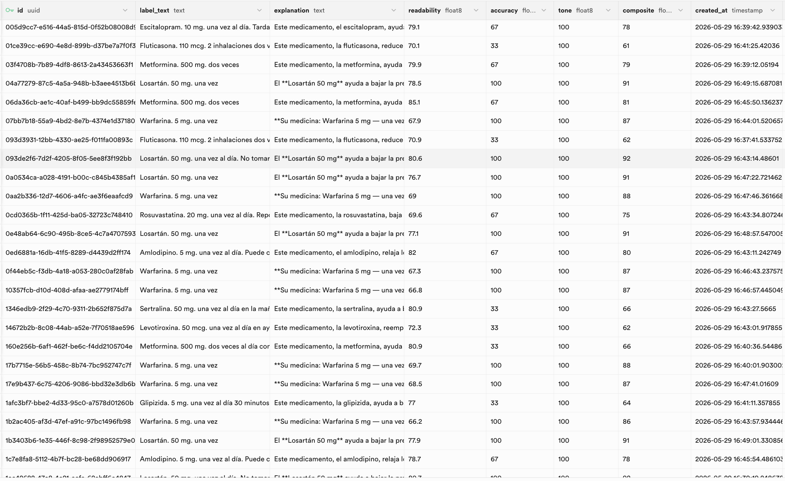
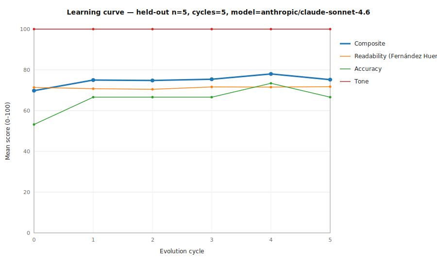

# RxExplainer

A mobile-first web app where Spanish-speaking patients photograph a prescription label and receive an immediate plain-language explanation in both text and natural-sounding Spanish audio.

**Live demo:** https://rx-explainer.vercel.app

**CS 153 final project** — Stanford, Spring 2026

---

## What it does

1. Patient photographs their prescription label
2. Claude Vision OCR extracts drug name, dosage, frequency, and warnings
3. A few-shot prompted model generates a warm, plain Latin-American Spanish explanation (6th-grade reading level)
4. ElevenLabs reads the explanation aloud
5. Every explanation is scored and stored in Supabase; a self-improvement loop rewrites low scorers and promotes high scorers into the example bank

## Research question

Can a few-shot prompted model with a curated domain-specific dataset outperform zero-shot Claude on plain Latin-American Spanish medical explanations — and can the system self-improve over time using automated metrics?

---

## Eval results

### Supabase — live explanations table



### Learning curve — composite score over 5 evolution cycles (n=5 held-out labels)



Composite score improves from **69.8 → 78.0** (peak at cycle 4) as the example bank grows. The gain is driven almost entirely by accuracy — the evolved bank teaches the model to include specific dosage and frequency details. Tone holds at 100 throughout.

---

## Scoring system (fully automated, no LLM-as-judge)

| Metric | Formula | Target |
|---|---|---|
| Readability | Fernández Huerta (Spanish-adapted Flesch-Kincaid) | 80–100 = patient level |
| Accuracy | % of drug name / dosage / frequency found in explanation | Higher is better |
| Tone | Penalize Castilian Spanish words (vosotros, coger, etc.) | 100 = clean |
| Composite | 0.4 × readability + 0.4 × accuracy + 0.2 × tone | >80 = promoted to example bank |

---

## Tech stack

| Layer | Tool |
|---|---|
| Frontend + API routes | Next.js |
| Vision OCR + explanation | Anthropic Claude (claude-sonnet-4.6) |
| Text-to-speech | ElevenLabs (eleven_multilingual_v2) |
| Database | Supabase (Postgres) |
| Hosting | Vercel |

---

## Running locally

```bash
npm install
```

Create a `.env` file:

```
ANTHROPIC_API_KEY=...
ELEVENLABS_API_KEY=...
SUPABASE_URL=...
SUPABASE_ANON_KEY=...
```

```bash
npm run dev
```

Open [http://localhost:3000](http://localhost:3000).

### Run the zero-shot benchmark

```bash
npx tsx scripts/zero-shot-benchmark.ts
```

### Run the learning-curve experiment

```bash
npx tsx scripts/learning-curve.ts --cycles 5
```
